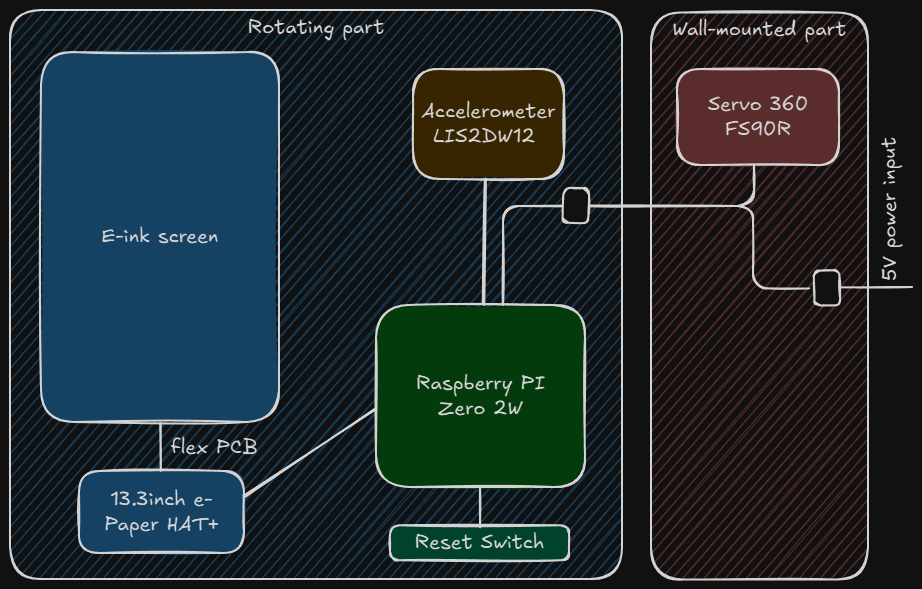
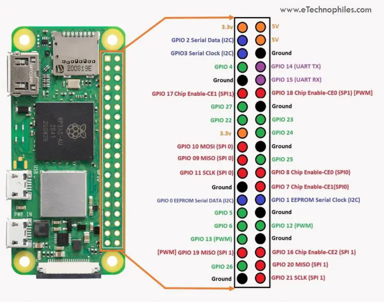

# Color E-ink Photoframe

## Installation

1. Install latest Raspberry pi OS (lite version) preferably using Raspberry Pi imager
2. Connect via SSH, run sudo raspi-config and setup following options:
   - System/autologin - as desktop user - usefull for debugging and connecting remotely
   - Advanced/expand filesystem
   - Interface/I2C Enable
3. Install RPi Connect https://www.raspberrypi.com/documentation/services/connect.html
4. Setup RPi to use EPD screen https://www.waveshare.com/wiki/13.3inch_e-Paper_HAT+_(E)_Manual#Raspberry_Pi
5. Install needed packages:
   ```shell
   sudo apt install imagemagick
   pip3 install pycountry babel reverse_geocoder --break-system-packages
   sudo apt install python3-smbus
   sudo apt install python3-flask
   ```

6. Fotoramka uses pgpio for controlling servo. This library uses daemon, which have to be started at startpu:
   ```shell
   sudo systemctl enable pigpiod
   sudo systemctl start pigpiod
   ```

6. Optionally for better stability with remote VSCode server increase SWAP size:
   - Stop the swap service `sudo dphys-swapfile swapoff`
   - Edit the configuration filr `sudo nano /etc/dphys-swapfile`
   - Change the swap size `CONF_SWAPSIZE=1024`
   - Reinitialize the swap file `sudo dphys-swapfile setup`
   - Start the swap service `sudo dphys-swapfile swapon`
   - Reboot

7. Install Excalifont:
   - `mkdir -p ~/.local/share/fonts`
   - `cp fotoramka/app/fonts/Excalifont-Regular.ttf ~/.local/share/fonts/`
   - update font cache `fc-cache -fv`

## Schematics



## Raspberry PI pinouts

Raspberry PI Zero 2W pinout diagram:

Pinouts:

|Function    |GPIO Pin      |
|------------|--------------|
|IMU I2C     |2,3           |
|Servo       |12            |

Raspberry PI bottom side test points:

Reset switch is connected to RUN and GND test points.

(Raspberry Pi drawings from: https://www.etechnophiles.com/rpi-zero-2w-board-layout-pinout-specs-price/)

## BOM
- Raspberry PI Zero 2W
- Waveshare 13.3inch E Ink Spectra 6 (E6) Full Color E-Paper Display With HAT
- IKEA FISKBO frame 21x30 cm
- Gravity: I2C LIS2DW12 Triple Axis Accelerometer Sensor https://www.dfrobot.com/product-2348.html
- Servo 360: Feetech FS90R - micro https://www.pololu.com/product/2820/faqs

## JPEG image quality

Fotoramka stores jpeg images resized & cropped to EPD screen resolution (1600x1200). Depending on quality setting, average image size will vary.

|JPEG quality|File size [KB]|
|------------|--------------|
|100         |1390          |
|98          |1010          |
|95          |714           |
|90          |481           |
