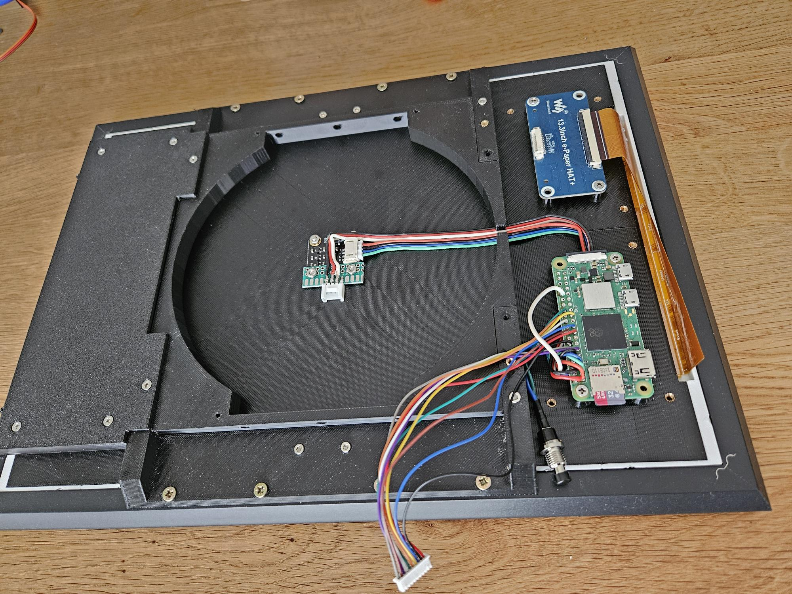

# Fotoramka - Color E-ink Photo frame


Open source color E-ink photo frame. 
The project is based on a 10-inch Spectra 6 color E-ink display. A Raspberry Pi Zero is used to control the display and store photos. The photo frame is equipped with a movable wall mount that allows the screen to rotate depending on whether the image is displayed in portrait or landscape orientation. Rotating the frame and updating the E-ink display takes about 30 seconds. This is not an issue for a photo frame application, as images are refreshed only once to three times per day. This is a hobby project done with my daughter, but I hope you might find it useful.


## Image quality

Eink can display only 6 basic colors: black, white, red, green, blue. In order to display other colors, color gradients and grayscale dithering have to be used. Despite this fact image quality is surprisingly  good. If you look up close, you will see individual dots of color, however from about 50cm your eyes will average the image and you won't see dithering artifacts. Compare following two images for the quality - on the left you can see whole image, on the right closeup with visible dithering.


As mentioned earlier, in order to display an image it has to be converted to a 6 color palette. There are several dithering algorithms available for this purpose. For the photo frame project I've tested two implementations:
- python pillow library, using convert function `image_temp.convert("RGB").quantize(palette=pal_image)`
- ImageMagic convert function `convert -dither FloydSteinberg`, according to https://learn.adafruit.com/preparing-graphics-for-e-ink-displays?view=all

My subjective opinion is that pillow implementation looks better, however  both options are implemented and tested. With ImageMagic you can play with diffusion-amount parameter. 

### Adjusting color palette

The biggest image improvement that I've done was adjusting color palette. The default color palette uses pure colors: black, white, yellow, red, blue, green. It turned out that true representation of colors on the display is not perfect. Yellow and blue are slightly darker, green is much darker and red is rather brown-ish. After adjusting color palette for real displayed colors, dithered images are looking much better. "Ideal" palette and my adjusted one are below:


Black (0,0,0)
White (255,255,255)
Red (126,10,28)
Green (68,145,66)
Blue (75,66,189)
Yellow (244,244,0)

Since I've only experimented with one e-ink display I don't know the variance of colors between different displays. Probably it's good idea to start with my modified palette and tweak it if needed.

## Schematics


## Raspberry PI pinouts

Raspberry PI Zero 2W pinout diagram:

Pinouts:

|Function    |GPIO Pin      |
|------------|--------------|
|IMU I2C     |2,3           |
|Servo       |12            |

Raspberry PI bottom side test points:

Reset switch is connected to RUN and GND test points.

(Raspberry Pi drawings from: https://www.etechnophiles.com/rpi-zero-2w-board-layout-pinout-specs-price/)

## Mechanical design

The E-ink display fits nice inside IKEA FISKBO photo frame. I've used this frame to provide nice looking front of the photo frame. Rest of the design, including gears for rotation is 3D printed. Mechanical parts are divided for small fragments that fit inside 18x18 cm build plate (I have Bambu Labs A1 Mini). The mechanical design was done in OneShape:

[OneShape Design](https://cad.onshape.com/documents/bf7610f1b793f8fbbfe2df17/w/a4ca347802ad8f25eb61531b/e/01e44886152732a9c1ba2d52?renderMode=0&uiState=68c19904ab50fb98eb3a576f)

Frame consists of two main parts. First is wall mounted, and includes rotation gear with 360 degree servomotor:


Second part is rotating and contains E-ink screen, screen driver PCB (blue one), Raspberry Pi, accelerometer - mounted in the rotation axis. I've added reset button for raspberry pi, since there will be no physical access to the board after frame is mounted on the wall.



The display part is connected to the wall-mount via 6x M3 screws easily accessible from the sides of the screen. 

## BOM
- Raspberry PI Zero 2W
- Waveshare 13.3inch E Ink Spectra 6 (E6) Full Color E-Paper Display With HAT https://www.waveshare.com/13.3inch-e-paper-hat-plus-e.htm, I bought my from Amazon Waveshare store
- IKEA FISKBO frame 21x30 cm
- Gravity: I2C LIS2DW12 Triple Axis Accelerometer Sensor https://www.dfrobot.com/product-2348.html
- Servo 360: Feetech FS90R - micro https://www.pololu.com/product/2820/faqs
- M2.5, M3 screws and threaded inserts

## Installation

1. Install latest Raspberry pi OS (lite version) preferably using Raspberry Pi imager
2. Connect via SSH, run sudo raspi-config and setup following options:
   - System/autologin - as desktop user - usefull for debugging and connecting remotely
   - Advanced/expand filesystem
   - Interface/I2C Enable
3. Install RPi Connect https://www.raspberrypi.com/documentation/services/connect.html
4. Setup RPi to use EPD screen https://www.waveshare.com/wiki/13.3inch_e-Paper_HAT+_(E)_Manual#Raspberry_Pi
5. Install needed packages:
   ```shell
   sudo apt install imagemagick
   pip3 install pycountry babel reverse_geocoder --break-system-packages
   sudo apt install python3-smbus
   sudo apt install python3-flask
   sudo apt install python3-peewee
   sudo apt install python3-apscheduler
   ```

6. Fotoramka uses pgpio for controlling servo. This library uses daemon, which have to be started at startpu:
   ```shell
   sudo systemctl enable pigpiod
   sudo systemctl start pigpiod
   ```

6. Optionally for better stability with remote VSCode server increase SWAP size:
   - Stop the swap service `sudo dphys-swapfile swapoff`
   - Edit the configuration filr `sudo nano /etc/dphys-swapfile`
   - Change the swap size `CONF_SWAPSIZE=1024`
   - Reinitialize the swap file `sudo dphys-swapfile setup`
   - Start the swap service `sudo dphys-swapfile swapon`
   - Reboot

7. Install Excalifont:
   - `mkdir -p ~/.local/share/fonts`
   - `cp fotoramka/app/fonts/Excalifont-Regular.ttf ~/.local/share/fonts/`
   - update font cache `fc-cache -fv`

8. Enable fotoramka service in systemd
   - in file fotoramka.service replace 'bieda' with your user name and WorkingDirectory
   - copy fotoramka.service `sudo cp fotoramka.service /etc/systemd/system/fotoramka.service`
   - update systemctl `sudo systemctl daemon-reexec`
   - start service `sudo systemctl start fotoramka`
   - stop service `sudo systemctl stop fotoramka`

## JPEG image quality

Fotoramka stores jpeg images resized & cropped to EPD screen resolution (1600x1200). Depending on quality setting, average image size will vary.

|JPEG quality|File size [KB]|
|------------|--------------|
|100         |1390          |
|98          |1010          |
|95          |714           |
|90          |481           |

## Image colors

R (126,10,28)
G (68,145,66)
B (75,66,189)
Y (244,244,0)
